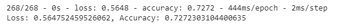

# Alphabet Soup Neural Network

## Overview

The purpose of this project is to develop a neural network can predict whether or not an venture capital applicant will be successful if the nonprofit foundation Alphabet Soup can provide funding. The goal will be to develop the model, optimize to reach at least 75% accuracy (or to try at least three times). 

## Results
### Data Preprocessing
In the initial model, the parameters are as follows: 

* Target: IS_SUCCESSFUL
* Features:
    - APPLICATION_TYPE
    - AFFILIATION
    - CLASSIFICATION
    - USE_CASE
    - ORGANIZATION
    - STATUS
    - INCOME_AMT
    - SPECIAL_CONSIDERATIONS
    - ASK_AMT
* Removed Features: 
    - EIN
    - NAME

"EIN" and "NAME" were removed from the input data as these are neither targets nor features--these are unique identifiers for each entry rather than generalizable characteristics. 

### Compiling, Training, Evaluating the Model

#### Initial Model

In the initial model, 3 layers were chosen. The first two had 'relu' activation function and the last one had 'sigmoid' activation function. 

* Layers: 3
    - Initial Layer: 43 inputs, 80 neurons, relu activation
    - Second Layer: 30 neurons, relu activation
    - Third Layer: 1 neuron, sigmoid activation
* 100 epochs

The goal of 75% accuracy was not reached--the output was 0.729. 

#### First Optimization Attempt

In the first attempt at optimization, the ask amount column was binned into five categories. I chose this feature to be binned as in the initial exploration, I found that this column had over 8,000 unique values, whereas other features had no more than 71 unique columns. 
* The "ASK_AMT" feature was binned into the following categories:
    - $5,000
    - $5,000 to $100,000
    - $100,000 to $1,000,000
    - $1,000,000 to $5,000,000
    - Over $5,000,000
At least 70% of all entries are at requesting $5,000. These binned categories were chosen by arbitrary selection of ranges, and seeing how many of the values were within that range. 

The get_dummies process was also applied to this feature. The # of neurons, layers, epochs and type of activation functions were not changed. The number of inputs were changed to 44 neurons. 

This resulted in a lowered accuracy at .7272

#### Second Optimization Attempt

In the second attempt at optimization, the number of neurons and layers were increased, as follows:

* Layers: 6
    - Initial Layer: 44 inputs, 200 neurons, relu activation
    - Second Layer: 100 neurons, relu activation
    - Third Layer: 64 neurons, relu activation
    - Fourth Layer: 32 neurons, relu activation
    - Fifth Layer: 16 neurons, relu activation
    - Sixth Layer: 1 neuron, sigmoid activation
* 100 epochs

This resulted in a slightly increased accuracy, but not more than the accuracy of the initial model:

#### Third Optimization Attempt

In the last attempt at optimization, the optimizer function was changed from "adam" to "sgd" (Stochastic Gradient Descent Optimizer), and the number of epochs was increased to 200. 

This resulted in lowered accuracy at .7252. 

## Conclusion

Attempts at optimizing the model by binning the "ask amount" column, increasing the number of layers and neurons, and trying different optimization models while increasing the number of epochs, ultimately did not hit 75%. Experimentation results hovered at around 72%. In the next attempt, random forests could be used to solve this classfication problem. Random forests combines randomly seleted decision trees to make a final prediction. 
